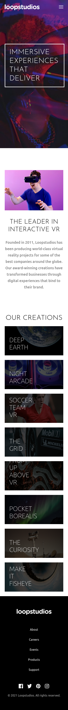
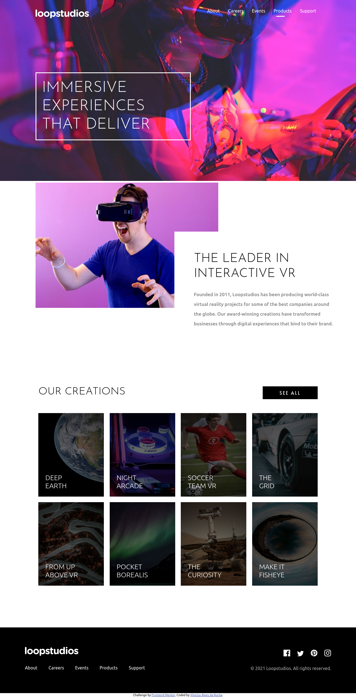

# Frontend Mentor - Loopstudios landing page solution By [Vinicius Alves da Rocha](https://www.linkedin.com/in/vinicius-rocha-developer/)

This is a solution to the [Loopstudios landing page challenge on Frontend Mentor](https://www.frontendmentor.io/challenges/loopstudios-landing-page-N88J5Onjw). Frontend Mentor challenges help you improve your coding skills by building realistic projects. 

## Run Project

1. To run project in localhost, clone project from repository [GitHub](https://github.com/ViniciusAlvesRocha/loopstudios-landing-page-main);

2. Enter in folder project and open CLI desktop;

3. Type 'npm install' to install project dependencies;

4. Type 'npm start' to open project in your browser;

OBS.: Have Node Package Maneger(npm) installed in your computer;

## Table of contents

- [Overview](#overview)
  - [The challenge](#the-challenge)
  - [Screenshots](#screenshots)
  - [Links](#links)
- [My process](#my-process)
  - [Built with](#built-with)
  - [Continued development](#continued-development)
  - [Useful resources](#useful-resources)
- [Author](#author)

## Overview

### The challenge

Users should be able to:

- View the optimal layout for the site depending on their device's screen size
- See hover states for all interactive elements on the page

### Screenshots

## Screenshot Mobile

## Screenshot desktop

### Links

- Solution URL: [GitGub](https://github.com/ViniciusAlvesRocha/loopstudios-landing-page-main)
- Live Site URL: [GitHub Pages](https://viniciusalvesrocha.github.io/loopstudios-landing-page-main/build/)

## My process

### Built with

- Semantic HTML5 markup
- CSS custom properties
- Flexbox
- Mobile-first workflow
- [React](https://reactjs.org/) - JS library

## Author

- Website - [Vinicius Alves da Rocha](https://viniciusalvesrocha.github.io/portfolio/)
- Frontend Mentor - [@ViniciusAlvesRocha](https://www.frontendmentor.io/profile/ViniciusAlvesRocha)
- Instagram - [@rochavini1](https://www.instagram.com/rochavini1/)

